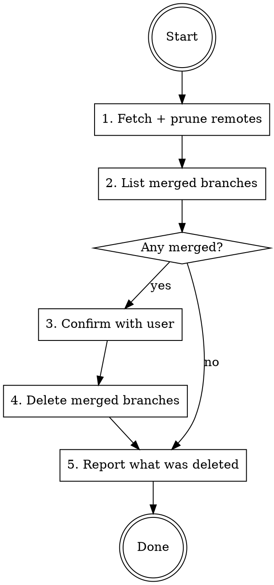

# Branch Prune

This skill helps you clean up local git branches that are no longer needed. It is an end-to-end workflow that finds branches which have already been merged into the main branch and removes them so that the local checkout stays tidy and easy to navigate over time.

## Workflow



## Steps

### 1. Fetch and prune remotes

```bash
git fetch --all --prune
```

### 2. List branches already merged into main

```bash
git branch --merged main | grep -v -E '^\*|main'
```

### 3. Confirm with the user

Show the list of merged branches and ask the user to confirm before deleting anything. Never delete branches without confirmation.

### 4. Delete the merged branches

```bash
git branch --merged main | grep -v -E '^\*|main' | xargs -r git branch -d
```

### 5. Report

Print a short summary of which branches were deleted and which (if any) were skipped.
